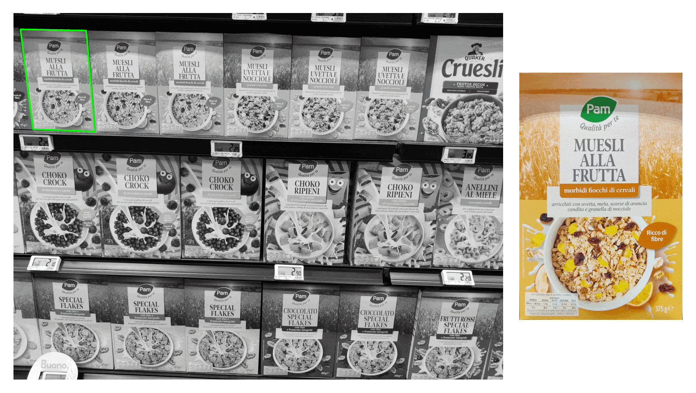
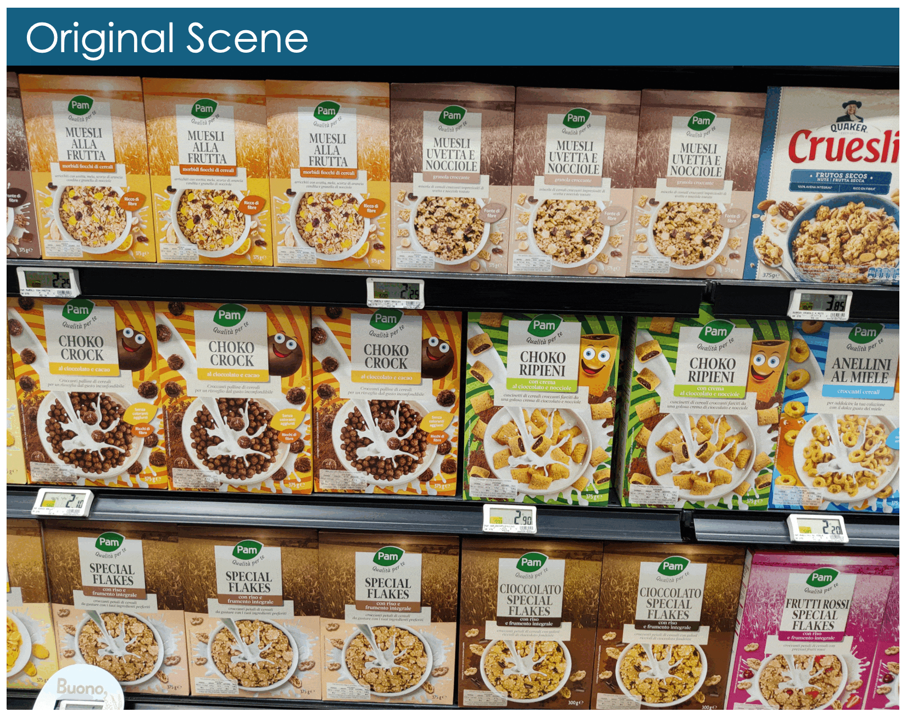

<p align="center">
  <h1 align="center">Template Matching: Detecting Packages on the Shelves
</p>

###

[](https://www.python.org/)
[](https://www.python.org/dev/peps/pep-0008/)
[](http://makeapullrequest.com)
[](https://github.com/antoninomariarizzo/template-matching/blob/main/LICENSE)


<div style="text-align: center;">
    
    <p><em>Fig. 1: Execution example of our Template Matching method.</em></p>
</div>

<div style="text-align: center;">
    
    <p><em>Fig. 2: Results of the Template Matching method. The shelves in the scene are overlaid with the projected templates, demonstrating the accurate localization of all template instances and the precise estimation of perspective distortions.</em></p>
</div>


### Introduction
**Template Matching** (TM) [1, 2] is a _Computer Vision_ task focused on identifying the regions of an input image that correspond to known reference images. 
In particular, given the image of a _scene_ to be analyzed and a set of images depicting known objects (referred to as _template_ images), the goal is to locate all regions within the scene that contain the template objects.

An example is shown in _Fig. 1_, where the templates (on the right), representing cereal boxes, are detected in the scene (on the left), which depicts the shelves of a supermarket. Please note that the templates are identified in a random order, but they have been sorted in _Fig. 1_ for visualization purposes.
The results of the analysis are illustrated in _Fig. 2_, where the projected templates are superimposed on the shelves.

Traditionally, TM methods are widely used in quality control and monitoring applications. 
For example, in a supermarket setting, these techniques can be applied to detect the quantity and proper arrangement of packages on shelves, supporting inventory management and restocking.

A popular approach to TM is the feature-based solution [2, 3], which involves three main stages:

1. **Feature Extraction**: Sparse local features are extracted from both the template and scene images. These features are designed to be robust to variations in scale, illumination, and orientation, ensuring consistency between the template and its instances within the scene.

2. **Feature Matching**: Since the features between the scene and the template are expected to be similar, we can establish point correspondences (or matches). When multiple instances of the template are present in the scene, these matches must be clustered to identify individual objects. It’s also important to account for potential mismatches.

3. **Geometric Validation**: Geometric consistency is used to cluster matches that belong to the same template instance, while mismatches are discarded.

Our repository implements the _feature-based_ TM as follows:

1. **Feature Extraction**: We use the Scale-Invariant Feature Transform (SIFT) [4] to extract features. This method detects distinctive keypoints in an image, each associated with a local descriptor. SIFT descriptors are specifically designed to be invariant to changes in scale, rotation, and illumination.

2. **Feature Matching**: We match keypoints by applying the Nearest Neighbor algorithm [5] in the descriptor space. For each descriptor in the scene, we find the most similar descriptor from the template.

3. **Geometric Validation**: To ensure the geometric consistency of the matches, we estimate homographies [6, 7] using the RANSAC algorithm [8]. To match multiple instances of the same template, we follow a sequential approach: we identify the most promising template, remove its inliers, and then repeat the search. This process continues until no valid matches are found.

For example, the results of the analysis using only the four templates shown in _Fig. 3_ is presented in _Fig. 4_. 

<div style="text-align: center;">
    
    <p><em>Fig. 3: Employed templates.</em></p>
</div>

<div style="text-align: center;">
    
    <p><em>Fig. 4: Result with four templates.</em></p>
</div>


### Install
1. Clone our repository.

2. Install required libraries by running `pip install -r requirements.txt`.

3. Install our package in editable mode by running:
`pip3 install -e .` from the root folder.


### Usage
A demonstration of our Template Matching method is available in the Jupyter notebook `demo.ipynb`. 
To run the analysis, execute `TemplateMatching.find_templates`, providing the path to the scene image and a list of template image paths. 
This method returns a list of found homographies, along with the corresponding paths to the templates used in the computation.

The `TemplateMatching` class consists of two main components:

- **SceneMatcher**: When initialized, this component extracts SIFT features from the scene. Please note that the feature extraction from the scene is performed only once for perfomance reasons. Then, for each template, the `get_matches` method extracts SIFT features and finds matches.

- **SequentialRANSACHomography**: This component performs geometric validation by running sequential RANSAC to fit multiple homographies between the scene and template points.

Note that `TemplateMatching.find_templates` processes different template instances in parallel for improved performance. Additionally, each search begins with all the matches, preventing any issues from the cascading effect of points removed by a wrong template.

Finally, **visualizations** are available in the `Plotter` component.


### Citation

If you use our code in a scientific publication, we would appreciate citations using the following format:
```cit
@misc{rizzo2024:template_matching,
  author    = {Antonino Maria Rizzo},
  title     = {Template Matching: Detecting Packages on the Shelves},
  year      = {2024},
  url       = {https://github.com/antoninomariarizzo/template-matching},
}
```


### Acknowledgments
We gratefully acknowledge [_Filippo Leveni_](https://github.com/ineveLoppiliF) for having provided the initial implementation of the code.


### References:

[1] OpenCV, _Template Matching_, https://docs.opencv.org/4.x/d4/dc6/tutorial_py_template_matching.html, Accessed: 2024-11-15.

[2] Luces R. N., _Template-based versus Feature-based Template Matching_, https://medium.datadriveninvestor.com/template-based-versus-feature-based-template-matching-e6e77b2a3b3a, Accessed: 2024-11-15.

[3] OpenCV, _Features2D + Homography to find a known object_, https://docs.opencv.org/3.4/d7/dff/tutorial_feature_homography.html, Accessed: 2024-11-15.

[4] Lowe D. G., _Distinctive image features from scale-invariant keypoints_, International Journal of Computer Vision (IJCV), 2004.

[5] Bishop, C. M., _Pattern Recognition and Machine Learning_, Springer, 2006.

[6] Hartley R., Zisserman A., _Multiple View Geometry_, Visual Geometry Group, Oxford, 2004.

[7] OpenCV, _Basic concepts of the homography explained with code_, https://docs.opencv.org/3.4/d9/dab/tutorial_homography.html, Accessed: 2024-11-15.

[8] Fischler M. A., Bolles R. C., _Random sample consensus: a paradigm for model fitting with applications to image analysis and automated cartography_, Commun ACM, 1981.


